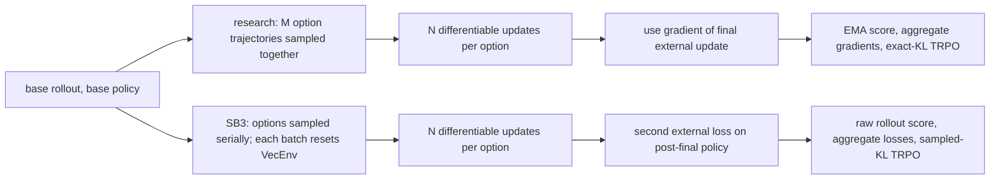

# SB3 IRPO mechanical audit

## Verdict

`stable-baselines3.IRPO` at `a1e8f93` is **not mechanically equivalent** to the
research IRPO in `asdf`.  Its results must be described as an SB3-native IRPO
prototype, not as a reproduction or a directly comparable IRPO sweep.

The largest mismatch is the outer objective: SB3 differentiates an additional
external loss *after* the final external subpolicy update.  The research code
uses the gradient of that final external update itself as the outer gradient.
That changes the optimisation problem before any provider-specific difference
is considered.

## Audit scope

| Implementation | Revision / input files |
| --- | --- |
| Research IRPO | `asdf` working tree based on `5bafb02`; `policy/irpo.py`, `policy/trpo.py`, `utils/intrinsic_rewards.py`, `utils/sampler.py`, and `algorithms/irpo.py` were modified but their SHA-256 inputs are recorded below. |
| SB3 fork | clean `irpo` branch at `a1e8f9303b11534c351af443aa1303d8ab1c6c36`. |

Research input SHA-256:

```text
85f442a797e48da3acd7664924dbf5f2f3d61189513155684087c07bbf7c6380  policy/irpo.py
9046377571bcdf0d5b5f1f67514b4c1aff594c0410683ba344b9ed4f9779ec00  utils/intrinsic_rewards.py
98d456f56e0b0ab8ee81e9c0832b86d94737b3877b10b010ad793fe0492fccf0  policy/trpo.py
17a21609b174c5b7e5d0cd215dffc8f4baffe5cad37655b24b55d6484171c4d0  utils/sampler.py
f4a504d892c93fac14f3847b31a2da3b02e55d85a7329f911c933e5a7fdb425e  algorithms/irpo.py
```

## Update topology



Both implementations nominally collect `1 + M(N - 1)` rollout batches per
IRPO iteration for `M` options and `N` subpolicy updates.  They do not assign
those batches, return targets, or gradients the same way.

## Parity blockers

| Area | Research IRPO | SB3 fork | Consequence |
| --- | --- | --- | --- |
| **Outer objective** | At the final inner step, `learn_subpolicy()` computes the external actor gradient at `theta_(N-1)`. `backprop()` propagates that gradient through the earlier `N - 1` updates. The final adapted actor `theta_N` is retained for provider updates, inference, and score bookkeeping. `policy/irpo.py:315-354, 691-802`. | `_adapt(..., final=True)` first applies the external update, producing `theta_N`; `learn()` then computes `option_loss = L_ext(theta_N, D_N)`. `stable_baselines3/irpo/irpo.py:261-272, 433-465`. | **Different meta-objective.** SB3 evaluates actions from `D_N`, sampled by `theta_(N-1)`, under `theta_N` without an importance ratio. This is an extra off-policy external loss absent from the research algorithm. |
| **Advantages and critics** | Each option has independent external and intrinsic critics, each fitted for `CRITIC_EPOCHS`; both use bootstrapped GAE with separate termination/truncation handling. The actor uses intrinsic GAE except on the final update, which uses external GAE. `policy/irpo.py:700-775`, `utils/rl.py:156-210`. | `_returns()` is normalized discounted reward-to-go, starts with zero at every rollout boundary, and treats any `done` as non-bootstrap. No intrinsic/extrinsic critics exist. `stable_baselines3/irpo/irpo.py:238-272`. | This is the deliberate simplification accepted for the fork, but it removes learned baselines, GAE, time-limit bootstrapping, and every critic update. It prevents parity. |
| **Rollout lifetime** | Worker trajectories continue until an environment termination/truncation; `next_states`, terminations, and truncations enter GAE. `utils/sampler.py:193-245`. | `_collect_batch()` calls `env.reset()` for every base and subpolicy batch, and does not carry `self._last_obs`; the return target has no bootstrap at `n_steps`. `stable_baselines3/irpo/irpo.py:183-247`. | More episode restarts and truncated return targets. This alone changes every subpolicy gradient when `n_steps` is shorter than an episode. |
| **Atari training reward** | Pacman config enables `clip_training_rewards`; the sampler stores `sign(reward)`. `config/envs/pacman.json`, `utils/sampler.py:226-231`. | Stores raw reward from the supplied SB3 environment. `stable_baselines3/irpo/irpo.py:208-212`. | The external inner step, option score, and meta gradient use differently scaled rewards for the configured Pacman experiment. |
| **Option score and aggregation** | Score is per-option `ext_returns.mean()` from the critic/GAE batch, smoothed as `perf_gains = beta * old + (1-beta) * score`; aggregation uses that EMA. Source retains `argmax`, `uniform`, and `softmax` modes. `policy/irpo.py:522-603`. | Score is one raw discounted final-rollout return; no EMA or `beta`; aggregation is always softmax. `stable_baselines3/irpo/irpo.py:281-287, 457-462`. | The weighting signal has a different estimator and history. Always-softmax and the direct evaluation score were intentional fork decisions, but they are not source parity. |
| **Evaluation policy** | `forward()` uses the current final subpolicy with highest `perf_gains` EMA. `policy/irpo.py:229-241`. | `predict()` uses a copied final subpolicy with the highest current raw discounted final-rollout score. `stable_baselines3/irpo/irpo.py:289-297, 450-461`. | This implements the later SB3 requirement, but selects a different policy whenever EMA ranking and current-rollout ranking disagree. |
| **Meta/TRPO constraint** | Copies the old actor and evaluates exact distribution KL; samples at `grad_batch_size`; IRPO calls it with 5 CG steps, 15 backtracks and source target KL/config. `policy/trpo.py:30-132`, `policy/irpo.py:804-825`. | Caps the Fisher sample at 256 observations; estimates KL from actions sampled from the current policy using `exp(log_ratio)-1-log_ratio`; defaults are target KL `0.001`, 5 CG steps, and 10 backtracks. `stable_baselines3/irpo/irpo.py:315-395`. | Both are trust-region-style updates, but their Fisher/KL estimates, line-search budget, and defaults differ. The source Pacman IRPO config sets target KL `0.0003`. |
| **Sampling concurrency** | After the shared base rollout, all option actors are passed to `OnlineSampler.collect_samples()` together; it forks `num_workers` per policy. `policy/irpo.py:477-504`, `utils/sampler.py:80-170`. | Options are collected one after another from one SB3 `VecEnv`; no option-parallel sampling exists. `stable_baselines3/irpo/irpo.py:429-452`. | Same nominal sample count, materially different wall-clock behaviour and stochastic ordering. The fork does not implement the requested parallel subpolicy sampling. |
| **Goal-conditioned IRPO** | Includes the separate `IRPO_G_Learner` path. `policy/irpo.py:861-1378`, `algorithms/irpo.py:123-136`. | No equivalent path; the constructor rejects `Dict` observations. `stable_baselines3/irpo/irpo.py:115-116`. | Goal-conditioned research experiments cannot be reproduced by the fork. |

## Intrinsic-reward providers

| Provider | Research implementation | SB3 implementation | Mechanical difference |
| --- | --- | --- | --- |
| `random` | A fixed extractor produces signed temporal differences of selected feature coordinates and updates a reward RMS normalizer. It has image-specific CNN handling. `utils/intrinsic_rewards.py:242-391`. | A single flattened `LazyLinear(256)` network emits one column per option; reward is its raw temporal difference. `stable_baselines3/irpo/intrinsic.py:14-54`. | Different network, option construction, and normalization. |
| `drnd` | One provider per option. Each provider has a ten-target DRND ensemble, normalized novelty (`reward_rms`), random target selection, 25% masked predictor updates, and a GAE critic update. `utils/intrinsic_rewards.py:925-990`; `policy/layers.py:797-867`. | One shared multi-output target/predictor pair, raw squared error per output, and an all-row predictor update. No ensemble statistics, mask, reward RMS, or DRND critic. `stable_baselines3/irpo/intrinsic.py:57-92`. | **Not a DRND port.** Its reward and training dynamics differ. |
| `lirpg` | One provider per option. The reward is action-dependent; it has an external critic and performs the clipped virtual policy update, external look-ahead objective, coefficient mixing, critic loss, and gradient clipping. `utils/intrinsic_rewards.py:829-923`; `policy/layers.py:877-922`. | One shared network outputs `tanh(r(next_state))`, with no action input, external critic, virtual PPO update, coefficients, or provider-local objective. It applies the aggregate IRPO loss gradient once after all options. `stable_baselines3/irpo/intrinsic.py:95-103`; `stable_baselines3/irpo/irpo.py:299-309, 452-463`. | **Not an LIRPG port.** The required LIRPG mechanism is absent. |
| `allo` | Builds/loads a dedicated ALLO extractor; if required it gathers random transitions and trains the graph/orthogonality/dual objective before IRPO. It uses selected signed feature differences and reward RMS. `utils/intrinsic_rewards.py:455-717`; `policy/layers.py:1443-1625`. | Requires an externally created checkpoint for a different flattened reward network. `allo_learning_rate` is stored but never used. `stable_baselines3/irpo/intrinsic.py:106-148`; `stable_baselines3/irpo/irpo.py:83-87, 153-169`. | **No ALLO pretraining is implemented.** This contradicts the required fork behaviour and cannot load a research ALLO checkpoint. |

For Atari, the provider mismatch is especially material: the research DRND and
fixed rewards explicitly use image-aware CNNs, while every SB3 provider starts
with `Flatten -> LazyLinear(256)`.  SB3's policy may be a `CnnPolicy`, but its
intrinsic provider is not a CNN provider.

## State, API, and test findings

| Finding | Evidence | Effect |
| --- | --- | --- |
| README example cannot construct a model. | It passes `batch_size=128` at `README.md:36`, but `IRPO.__init__` has no `batch_size` parameter. The exact invocation raised `TypeError: IRPO.__init__() got an unexpected keyword argument 'batch_size'`. | The documented Pacman entry point is broken before training starts. |
| Documentation is stale about the update method. | README says “SGD meta updates” at `README.md:7-9`; the class docstring also says TRPO is not exposed at `stable_baselines3/irpo/irpo.py:59-62`, but `_meta_update()` implements TRPO. | A user cannot rely on the README to understand the active implementation. |
| Resumed LIRPG is invalid. | SB3 saves `_lirpg_optimizer` by pickle while `_setup_model()` replaces the reward provider. A save/load identity check after LIRPG training found `optimizer_matches_provider=False` (4 optimizer parameters and 4 different provider parameters). | The resumed optimizer updates detached, stale parameters rather than the restored LIRPG reward network. |
| SB3 provider optimizer state is incomplete. | `intrinsic_provider.state_dict()` saves parameters/buffers, not DRND's optimizer; the research providers explicitly add optimizer and RMS state via `get_extra_state()`. `stable_baselines3/irpo/irpo.py:484-485`; `utils/intrinsic_rewards.py:776-803`. | DRND resumes with fresh optimizer moments. |
| Tests establish plumbing only. | SB3 smoke test trains CartPole for 32 steps and asserts only `num_timesteps >= 32`; ALLO uses an artificial SB3-only checkpoint. `tests/test_irpo_smoke.py`. | Passing smoke tests do not establish source parity, Atari support, or return improvement. |

## Checks run

- SB3 `tests/test_irpo_smoke.py`: passed for `random`, `drnd`, `lirpg`, and its
  synthetic ALLO checkpoint.
- Research `tests/test_irpo_option_streaming.py`: passed for LIRPG and DRND;
  streamed and unstreamed source updates matched.
- Research `tests/test_irpo_nonfinite_diagnostics.py`: passed.
- README construction check: reproduced the `batch_size` `TypeError` above.
- SB3 LIRPG save/load identity check: reproduced the stale-optimizer mismatch
  above.

## What a comparable SB3 sweep requires

Do not launch a source-versus-SB3 performance comparison until these are
resolved in order:

1. Make the SB3 outer gradient use the final external update loss at
   `theta_(N-1)`, then adapt to `theta_N` only for the final subpolicy snapshot.
   This is the smallest change that aligns the IRPO objective topology.
2. Port source GAE/critic handling and preserve trajectories across rollout
   chunks, including truncation bootstrapping and Pacman reward clipping.
3. Port LIRPG, DRND, and ALLO as their source mechanisms. ALLO must pretrain in
   `IRPO` initialization using `allo_learning_rate`, rather than require
   `allo_encoder_path`.
4. Match the source score/EMA and exact-KL TRPO path, or explicitly make each
   deliberate change a named experimental variant.
5. Add a fixed-rollout parity test: seed identical tiny actors, batches, and
   provider parameters; compare each inner gradient, the aggregated outer
   gradient, the selected policy, and provider/optimizer state after one
   iteration.

Before then, an SB3-only sweep can answer whether this prototype learns; it
cannot answer whether SB3 IRPO and the research IRPO are the same algorithm.
